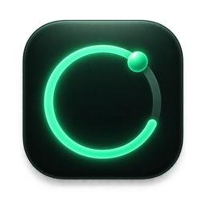
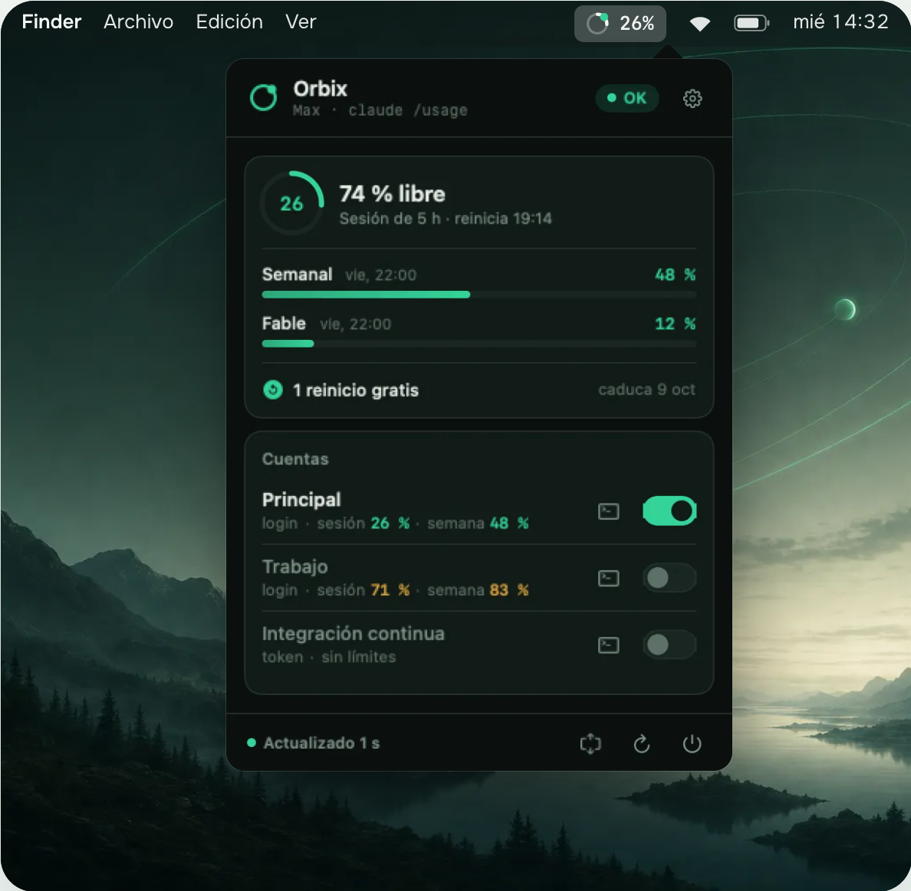
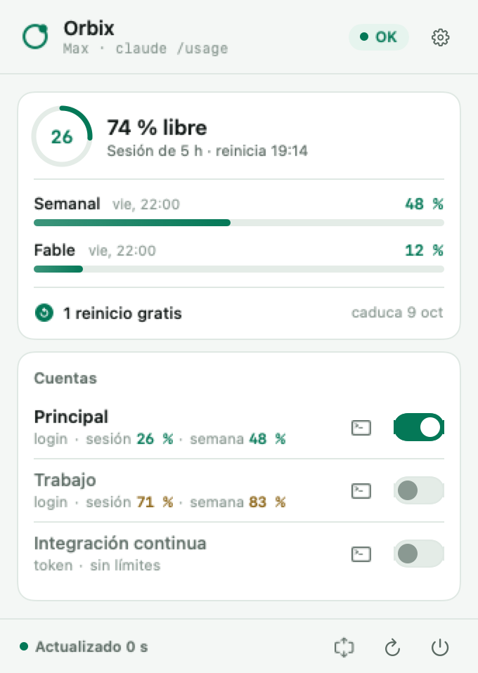

<div align="center">



# Orbix

**Tu límite de Claude, siempre a la vista en la barra de menús del Mac.**

[](https://github.com/elrincondeisma/orbix-mac/releases/latest)


[](https://github.com/elrincondeisma/orbix-mac/releases)

[Descargar](https://github.com/elrincondeisma/orbix-mac/releases/latest) ·
[Funciones](#-funciones) ·
[Instalar](#-instalar) ·
[Uso](#-uso) ·
[Cómo funciona](#%EF%B8%8F-cómo-funciona) ·
[Desarrollo](#%EF%B8%8F-desarrollo)

<br>



</div>

<br>

## ¿Por qué?

Claude avisa del límite cuando ya lo has alcanzado. **Orbix** te lo enseña antes: cuánto te queda de la sesión
de 5 horas y de la semana, cuándo se reinicia cada una, qué extras tienes sin gastar y cuánto te costaría ese uso
si lo pagaras por API. Todo desde un icono en la barra de menús, sin abrir la terminal ni el navegador.

## ✨ Funciones

| | Función | Detalle |
|:-:|---|---|
| ⏱️ | **Sesión de 5 horas** | Porcentaje libre, hora de reinicio y un aro que pasa a ámbar al 70 % y a rojo al 90 %. |
| 📅 | **Límites semanales** | El general y los de cada modelo, con su día y hora de reinicio. |
| 🔁 | **Varias cuentas** | Perfiles de Claude Code con login o token de larga duración. Un interruptor elige cuál usa `claude`. |
| 🎁 | **Extra sin usar** | Reinicios gratis guardados, saldo prepago y uso extra del mes, leídos de claude.ai. |
| 💸 | **Coste equivalente en API** | La sesión actual y los últimos 30 días a precio de lista, a partir de tus sesiones locales. |
| 📊 | **Actividad** | Tokens por día, respuestas, sesiones y modelos más usados en Claude Code. |
| 🪟 | **Dos vistas** | Compacta por defecto; la completa a un clic. El panel se adapta a la altura de tu pantalla. |
| 🟢 | **Estado de un vistazo** | En la barra de menús, un arco con el uso de la sesión, un punto de color y el porcentaje. |
| 🚀 | **Abre al iniciar sesión** | Te lo pregunta la primera vez; se cambia en Ajustes o en los ítems de inicio de macOS. |
| 🔄 | **Se actualiza sola** | Comprueba una vez al día, verifica la firma de la descarga y se reinicia. |
| 🌗 | **Claro y oscuro** | Sigue la apariencia de macOS. |
| 🔒 | **Privada** | Sin cuentas, sin analíticas y sin servidores propios. Nunca lee el contenido de tus conversaciones. |

## 📥 Instalar

1. Descarga **`Orbix-<versión>.dmg`** del [último release](https://github.com/elrincondeisma/orbix-mac/releases/latest).
2. Ábrelo y arrastra **Orbix** a **Aplicaciones**.
3. Ábrela: aparece en la **barra de menús**, arriba a la derecha, y te pregunta si quieres que se abra al iniciar sesión.

> [!NOTE]
> Orbix está **firmada con Developer ID y notarizada por Apple**: se abre sin avisos de Gatekeeper. Si la abres
> directamente desde el `.dmg`, te ofrecerá moverla a Aplicaciones, porque solo desde ahí puede actualizarse sola.

**Requisitos:** macOS 14 Sonoma o posterior · Apple Silicon o Intel ·
[Claude Code](https://docs.claude.com/en/docs/claude-code) instalado y con la sesión iniciada.

## 🧭 Uso

### El panel

<table>
  <tr>
    <td width="50%" valign="top">
      <picture>
        <source media="(prefers-color-scheme: dark)" srcset="docs/images/panel-compacta-oscuro.png">
        
      </picture>
    </td>
    <td width="50%" valign="top">
      <b>Vista compacta</b>: la sesión de 5 horas, los límites semanales, tus reinicios gratis y tus cuentas.
      <br><br>
      <b>Vista completa</b>: añade los extras de claude.ai, el coste equivalente en API, la actividad de la
      semana y los modelos que más usas. Se cambia con el botón del pie del panel o en Ajustes.
      <br><br>
      <b>Ajustes</b>: el engranaje de la cabecera. Inicio automático, vista, perfiles, origen de los datos,
      lectura del navegador, frecuencia de actualización y actualizaciones de la app.
    </td>
  </tr>
</table>

### Varias cuentas

Cada cuenta vive en su propio perfil de Claude Code (`~/.claude-perfiles/<nombre>`), con su login, su historial y
sus servidores MCP. Los ajustes, tus instrucciones, tus skills, tus comandos y tus agentes se comparten con la
cuenta principal.

- **Crear un perfil:** *Ajustes → Perfiles de Claude Code → Nuevo perfil*. Si es de tipo **login**, se abre una
  Terminal donde haces `/login` una vez. Si es un **token de larga duración** (`claude setup-token`), lo pegas y
  se guarda en tu Llavero.
- **Elegir cuenta:** enciende su interruptor en el panel. Los próximos `claude` que abras entran con ella.
- **Desde la terminal**, tras pulsar *Activar* en Ajustes (añade una línea a `~/.zshrc`):

```bash
claude                      # abre Claude Code con la cuenta activa
claude --perfil trabajo     # otra cuenta, solo esta vez
orbix-perfil trabajo        # cambia la cuenta activa
orbix-perfil                # muestra la activa y las disponibles
```

> [!TIP]
> *Aplicar también a las apps* hace que VS Code y otras apps que lanzan Claude Code usen el perfil activo.
> Los tokens de larga duración nunca se exponen así.

## ⚙️ Cómo funciona

### De dónde salen los datos

| Dato | Origen | Credenciales |
|---|---|---|
| Sesión y límites semanales | `claude -p "/usage" --no-session-persistence`, sin herramientas ni MCP | Ninguna: usa la sesión de Claude Code |
| Actividad y coste en API | Recuento de tokens de `~/.claude/projects/**/*.jsonl` | Ninguna |
| Reinicios gratis, saldo y uso extra | API de claude.ai con tu sesión del navegador (Arc, Chrome, Brave, Edge o Vivaldi) | Permiso de macOS para la clave del navegador, una vez |
| Límites de cada perfil | `claude /usage` ejecutado dentro de ese perfil | Las de cada perfil |

- **Consulta de límites.** Orbix ejecuta `claude /usage` en una carpeta propia y sin guardar la sesión, así que
  no aparece en tu historial. Tarda unos 2 segundos.
- **Coste en API.** De cada línea de los registros solo se leen la fecha, el modelo y el recuento de tokens. Las
  respuestas repetidas se cuentan una vez y se aplican los precios de lista: entrada, salida, lectura de caché y
  escritura de caché (×1,25 con 5 minutos, ×2 con 1 hora), y el doble en modo rápido.
- **Sin renovar tokens.** Orbix nunca renueva ni modifica el login de Claude Code; eso lo gestiona el propio
  Claude Code en cada perfil.

### Privacidad

- **No envía nada a servidores propios:** no hay cuentas, analíticas ni telemetría.
- **No lee tus conversaciones**, solo el recuento de tokens de cada respuesta.
- **Guarda los secretos en el Llavero:** los tokens que pegas y, si la activas, la lectura de la sesión del
  navegador.
- Deja un registro de diagnóstico en `~/Library/Logs/Orbix.log` con estados y códigos HTTP, **nunca** cookies
  ni tokens.

## 🛠️ Desarrollo

Basta con las **Command Line Tools** de Xcode; no hace falta Xcode completo.

```bash
./Scripts/setup-sparkle.sh    # la primera vez: herramientas de Sparkle
./Scripts/build-app.sh        # compila Orbix.app universal y la firma
open build/Orbix.app
```

<details>
<summary><b>Estructura del proyecto</b></summary>

```
Sources/Orbix/
  main.swift, AppDelegate.swift  Arranque, icono de la barra de menús y panel
  UsageStore.swift               Estado, temporizador y elección de la fuente de datos
  Models/Usage.swift             Límites, extras y modelos de datos
  Services/ClaudeCLIUsage.swift  Ejecuta `claude /usage` e interpreta su salida
  Services/ClaudeAPI.swift       Clientes de la API de uso y de claude.ai
  Services/LocalSessionScanner   Tokens y coste por día y modelo desde las sesiones locales
  Services/APIPricing.swift      Precios de lista de la API por modelo
  Services/ChromeSession.swift   Sesión de claude.ai desde navegadores Chromium
  Services/Profiles/             Perfiles, tokens de larga duración y función de terminal
  Services/AppUpdater.swift      Actualizaciones automáticas (Sparkle)
  Services/AppMover.swift        Ofrece mover la app a Aplicaciones
  Services/LoginItem.swift       Abrir al iniciar sesión (ítems de inicio de macOS)
  Views/                         Panel, tarjetas, ajustes, tema y logotipo
Scripts/
  build-app.sh                   Empaqueta y firma Orbix.app
  make-dmg.sh                    Instalador .dmg firmado y notarizado
  release.sh                     Publica una versión en GitHub Releases
  make-icon.sh                   Genera AppIcon.icns
site/                            Web del proyecto (Astro)
```

</details>

### Publicar una versión

```bash
./Scripts/release.sh 0.3.0 "Qué cambia en esta versión"
```

El script compila la versión universal, la firma con Developer ID, la **notariza** y adjunta el ticket. Después
crea el `.zip` para las actualizaciones con su firma EdDSA, genera el `appcast.xml` y crea el instalador `.dmg`,
también firmado y notarizado. Por último etiqueta la versión y publica el release en GitHub.

<details>
<summary><b>Requisitos para publicar</b></summary>

- Un certificado **Developer ID Application** en el Llavero.
- Un perfil de `notarytool`:
  `xcrun notarytool store-credentials orbix-notary --apple-id <email> --team-id <TEAM_ID>`
- La clave privada EdDSA de las actualizaciones en el Llavero (cuenta `orbix`). La pública está en
  `SUPublicEDKey` de `Scripts/build-app.sh`. **No la regeneres:** las copias instaladas solo aceptan
  actualizaciones firmadas con ella.

</details>

## 📄 Avisos

Orbix es un proyecto independiente y **no está afiliado a Anthropic**. Claude y Claude Code son marcas de
Anthropic. Las licencias de terceros están en [THIRD_PARTY_NOTICES.md](THIRD_PARTY_NOTICES.md).

<div align="center">
<br>
Hecho por <a href="https://github.com/elrincondeisma">Ismael Catala</a>
</div>
